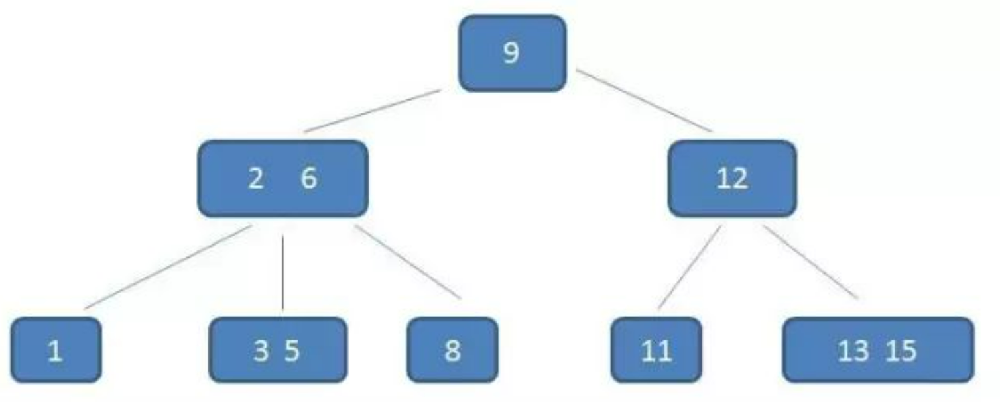
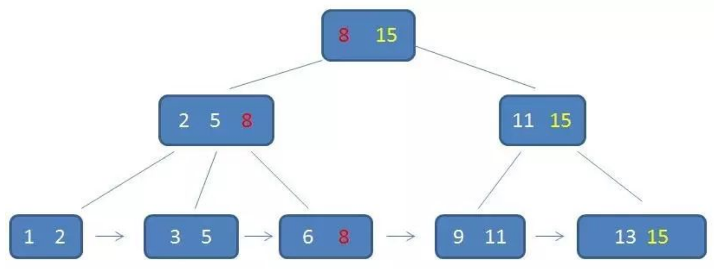

# B-树
## B-树的特点

- B-树，或者叫B树，B的意思是balance，B-树是一种多路平衡查找树

---

一个 m 阶的 B-树具有如下几个特征：
1. 根节点至少有两个子节点
2. 每个中间节点都包含 k-1 个元素和 k 个孩子，其中 m/2 <= k <= m（比如3阶的中间节点最多有2个元素、3个子节点）
3. 每一个叶子节点都包含 k-1 个元素，其中 m/2 <= k <= m
4. 所有的叶子结点都位于同一层
5. 每个节点中的元素从小到大排列，节点当中 k-1 个元素正好是 k 个孩子包含的元素的值域分划
---
- B-树的高度为：

$$
log_mN
$$

- 其中 m 是B-树的阶，也就是一个结点可以最多包含关键字的个数，N 为结点个数
- 下面是一个3阶的B-树

## B-树的调整

- B-树维持平衡的方式不是旋转，而是`节点的分裂、重组`

## 复杂度分析

- B-树查询操作的时间复杂度一般为O(h)，h为B-树的高度
- 一般而言，B-树的结点所包含的键的数目和磁盘块大小一样，从数个到数千个不等

## 磁盘页的概念（补充）todo 待记忆
- 在计算机里，无论是内存还是磁盘，操作系统都是按页的大小进行读取的（页大小通常为 4 kb），磁盘每次读取都会预读，会提前将连续的数据读入内存中，这样就避免了多次 IO，这就是计算机中有名的`局部性原理`，即我用到一块数据，很大可能这块数据附近的数据也会被用到，干脆一起加载，省得多次 IO 拖慢速度， 这个连续数据有多大呢，必须是操作系统`页大小的整数倍`，这个连续数据就是 MySQL 的页，默认值为 16 KB，也就是说对于 B+ 树的节点，最好设置成页的大小（16 KB），这样 B+ 树上的单个节点就只会有一次 IO 读
- 这个页大小是不是越大越好呢，设置大一点，节点可容纳的数据就越多，树高越小，IO 不就越小了吗，这里要注意，页大小并不是越大越好，InnoDB 是通过内存中的缓存池（pool buffer）来管理从磁盘中读取的页数据的。页太大的话，很快就把这个缓存池撑满了，可能会造成页在内存与磁盘间频繁换入换出，影响性能

## B-树的优点
- 由于数据库索引是存储在磁盘上的，索引很大的情况下不可能全部加载到内存，一个索引节点对应1次IO，这就意味着多次IO操作，如果使用红黑树或AVL树，树高h将会很大

- 采用B-树可以降低树高，`减少索引的磁盘IO次数`，提升索引查询性能

  - 比如：假设我们现在有 838,8608 条记录，对于红黑树而言，树的高度 h = log(838,8608) = 23，也就是说如果要查找到叶子结点需要 23 次磁盘 I/O 操作；
  - 但是 B-树，情况就不同了，假设每一个结点可以包含 8 个键（当然真实情况下没有这么平均，有的结点包含的键可能比8多一些，有些比 8 少一些），那么整颗树的高度将最多 8 层
  - 也就意味着磁盘查找一个叶子结点上的键的磁盘访问只有 8 次
$$
log_8(838,8608)=7.8
$$

## B-树的缺点 待记忆 todo

- B-树的key的类型如果不是自增id，而是大量随机节点的插入、删除，可能会导致频繁的页分裂和合并，进而导致索引性能下降
- 一般来说，当一个节点的key的个数小于m/2时，就会进行页合并，大于等于m时，就会分裂（m是树的阶）

## B-树的应用

- 适用于数据量很大，无法全部加载到内存中的场景，如：文件系统以及数据库索引（大部分采用B+树，如InnoDB引擎）
- MongoDB

# B+树
## B+树的特点

B+树是B树的变体，有更好的查询性能

---

1. 最大元素在根节点（B-树是类似二叉排序树）
2. 有 k 个子树的中间节点包含有 k 个元素（B-树中是 k-1 个元素），每个元素不保存数据，只用来索引，
所有数据都保存在叶子节点
3. 所有的叶子结点中包含了全部元素的信息，及指向含这些元素记录的指针，且叶子结点本身依关键字的大小自小而大顺序链接
4. 所有的中间节点元素都同时存在于子节点，在子节点元素中是最大（或最小）元素
---

## 卫星数据
- 即索引元素指向的数据记录
- B-树中，所有节点都带有卫星数据（或指向卫星数据的指针）
- 而B+树中，只有叶子节点有。`在InnoDB的聚簇索引中，叶子节点直接包含卫星数据`
## B+树的优点
B+树的优点和B-树差不多，我们只需关注它相比与B-树的优势：
1. IO次数更少，因为B+树中间节点没有卫星数据，可存储更多的索引元素，所以相同数据量情况下，B+树更加“矮胖”
2. 查询性能稳定，因为所有查询都要查找到叶子节点，稳定性意味着行为可预估，有利于查询优化器的实现（知乎上看到的）
3. 范围查询更快，因为只需遍历叶子节点链表，而B树需要中序遍历

# 参考
- [漫画：什么是B-树？](https://mp.weixin.qq.com/s?__biz=MzIxMjE5MTE1Nw==&mid=2653190965&idx=1&sn=53f78fa037386f85531832cd5322d2a0&chksm=8c9909efbbee80f90512f0c36356c31cc74c388c46388dc2317d43c8f8597298f233ca9c29e9&scene=21#wechat_redirect)
- [图解：什么是B树](https://mp.weixin.qq.com/s?__biz=Mzg2NzA4MTkxNQ==&mid=2247488498&idx=2&sn=44839d65ffb7aa7e83cc3df24bc6363e&chksm=ce405826f937d130e700d561cc9084c23f30db10548b8ba2b3672369fc122001cb6c857ffc5d&mpshare=1&scene=24&srcid=&sharer_sharetime=1593167674720&sharer_shareid=f6cbb58db594bbc05836e46394e8fd80&key=65359c7fdab27a2384f923fd5c2fc7cd2f17598fe79115131da8313b9f1fe07b27c4aa7e902045b55484f5232460f2c565dd17dad3282d25d98bc560eef535e429ace03bf5e418561b00a68bdd18ae91&ascene=1&uin=MzQ3MjE1OTMwNA%3D%3D&devicetype=Windows-QQBrowser&version=6103000b&lang=zh_CN&exportkey=A6qRRL6NO5oyvxws8O3pqY0%3D&pass_ticket=HWeOQWbIY55EgidilfbR3Nk0TIlv%2BAGiHCKKoW5%2BCHB1UR92u1A3i8fTHPU0IrZS&wx_header=0)
- [漫画：什么是B+树？](https://mp.weixin.qq.com/s?__biz=MzIxMjE5MTE1Nw==&mid=2653191027&idx=1&sn=4ba22e3ec8bd149f69fc0aba72e4347e&chksm=8c9909a9bbee80bfa1d8497ff0525df130414c1731b5aa5287bf16ea1cf86c8d8e6f20782184&scene=21#wechat_redirect)
- [面试官，你要是敢在问我B+树，别怪我不客气！！](https://mp.weixin.qq.com/s?__biz=Mzg2NzA4MTkxNQ==&mid=2247487296&idx=1&sn=98f6fd5042117e73e4cfe57741a28372&chksm=ce404494f937cd820e254a7248d8777891c7de35e9472fb4b9f27730523a6bfb5fecd7261b62&mpshare=1&scene=1&srcid=&sharer_sharetime=1586774132725&sharer_shareid=f6cbb58db594bbc05836e46394e8fd80#rd)