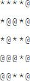

# 题目

- [UVA572 油田 Oil Deposits](https://www.luogu.com.cn/problem/UVA572)
- 输入一个m行n列的字符矩阵，统计字符“@”组成多少个八连块。如果两个字符“@”所在的格子相邻（横、竖或者对角线方向），就说它们属于同一个八连块。例如，图中有两个八连块。\


- leetcode上差不多的题：[岛屿数量](https://leetcode-cn.com/problems/number-of-islands/)

# 思路

- 实际上就是求图的`连通分量个数`
- 一般用dfs
- `并查集`也可以
- 并查集有两种优化策略：
  - `路径压缩`：让每个元素的pre[x]值存放根节点的值，而不是它的父节点。因为我们不关心树的结构，只关心哪些点在同一个树中
  - `按秩合并`：给每个集合的老大（也就是根节点）关联一个秩（rank），秩可以简单的理解为`该节点在树中的高度`，比如0就表示它是叶子节点，在合并两个集合的时候，把`秩小的集合的根节点指向秩大的集合的根节点`，这样做的目的就是使得合并后的树的高度尽可能的小（画个图就理解了），那么以后的根搜索路径就缩短了

# DFS

## C++实现

```c++
#include <cstdio> 
#include <cstring>
const int maxn = 100;
int m, n, idx[maxn][maxn];//连通分量编号 
char pic[maxn][maxn];

void dfs(int r, int c, int id){
	if(r < 0 || c < 0 || r >= m || c >= n) return;
	if(pic[r][c] != '@' || idx[r][c] > 0) return;
	idx[r][c] = id;
	for(int dx = -1; dx <= 1; dx++)
		for(int dy = -1; dy <= 1; dy++)
			if(dx != 0 || dy != 0) dfs(r+dx, c+dy, id);
}
int main(){	
	while(scanf("%d%d", &m, &n) == 2 && m && n){
		for(int i = 0; i < m; i++) scanf("%s", pic[i]);
		memset(idx, 0, sizeof(idx));
		int cnt = 0;
		for(int i = 0; i < m; i++)
			for(int j = 0; j < n; j++)
				if(idx[i][j] == 0 && pic[i][j] == '@') dfs(i, j, ++cnt);//连通分量数量++ 
		printf("%d\n", cnt);
	}
	return 0;
}
```

## Java实现

```java
public class Space {
	static int row=5, column=5;
	static char[][] arr = new char[][] {
		{'*','*','*','*','@'},
		{'*','@','@','*','@'},
		{'*','@','*','*','@'},
		{'@','@','@','*','@'},
		{'@','@','*','*','@'},
	};
	static int[][] idx = new int[row][column];
	
	public static void main(String[] args) {	
		
		int connect_component_id = 0;
		for(int i = 0; i < row; i++)
			for(int j = 0; j < column; j++)
				if(idx[i][j] == 0 && arr[i][j] == '@')
					dfs(i, j, ++connect_component_id);
		
		System.out.println(connect_component_id);
	}
	
	public static void dfs(int r, int c, int id) {
		if(r < 0 || c < 0 || r >= row || c >= column) return;
		if(arr[r][c] == '*' || idx[r][c] > 0) return; // ！=0 也可以
		idx[r][c] = id;
		for(int dx = -1; dx <= 1; dx++)
			for(int dy = -1; dy <= 1; dy++)
				if(dx != 0 || dy != 0) dfs(r+dx, c+dy, id);
	}
}
```

# 并查集

## Java实现

```java
/**
 * @description 岛屿数量
 */
public class Solution {
    static class UnionFind {
        int count;
        int[] parent;
        int[] rank;

        public UnionFind(char[][] grid) {
            count = 0;
            int m = grid.length;//row
            int n = grid[0].length;//column
            parent = new int[m * n];
            rank = new int[m * n];
            for (int i = 0; i < m; ++i) {
                for (int j = 0; j < n; ++j) {
                    if (grid[i][j] == '1') {
                        parent[i * n + j] = i * n + j;
                        ++count;
                    }
                    rank[i * n + j] = 0;//1也行
                }
            }
        }

        public int find(int i) {
            if (parent[i] != i)
                parent[i] = find(parent[i]);//path compression
            return parent[i];
        }

        public void union(int x, int y) {
            int rootx = find(x);
            int rooty = find(y);
            if (rootx != rooty) {
                if (rank[rootx] > rank[rooty]) {
                    parent[rooty] = rootx;//这里没有必要++rank，因为这种情况合并后树的高度没变
                } else if (rank[rootx] < rank[rooty]) {
                    parent[rootx] = rooty;
                } else {
                    parent[rooty] = rootx;
                    rank[rootx] += 1;
                }
                --count;
            }
        }

        public int getCount() {
            return count;
        }
        public int[] getRank(){
            return rank;
        }

        public int[] getParent(){
            return parent;
        }
    }

    public static int numIslands(char[][] grid) {
        if (grid == null || grid.length == 0) {
            return 0;
        }

        int nr = grid.length;
        int nc = grid[0].length;
        UnionFind uf = new UnionFind(grid);
        int k = 0;
        for (int r = 0; r < nr; ++r) {
            for (int c = 0; c < nc; ++c) {
                if (grid[r][c] == '1') {//如果是岛屿，则判断四周是否有相连的岛屿，有就合并
                    grid[r][c] = '0';//之后就可以直接跳过该点
                    if (r - 1 >= 0 && grid[r-1][c] == '1') {
                        uf.union(r * nc + c, (r-1) * nc + c);
                    }
                    if (r + 1 < nr && grid[r+1][c] == '1') {
                        uf.union(r * nc + c, (r+1) * nc + c);
                    }
                    if (c - 1 >= 0 && grid[r][c-1] == '1') {
                        uf.union(r * nc + c, r * nc + c - 1);
                    }
                    if (c + 1 < nc && grid[r][c+1] == '1') {
                        uf.union(r * nc + c, r * nc + c + 1);
                    }
                }
//                System.out.println(++k + " " + Arrays.toString(uf.getRank()));
            }
        }
        System.out.println(Arrays.toString(uf.getParent()));
        return uf.getCount();
    }

    public static void main(String[] args) {
        char[][] chars = new char[][]{
                {'0','1','0','0','0','0'},
                {'1','1','1','0','1','1'},
                {'0','1','0','1','1','1'},
                {'0','1','1','1','0','1'},
                {'1','1','0','0','1','1'}
        };

        int res = numIslands(chars);
        System.out.println(res);

    }
}
```