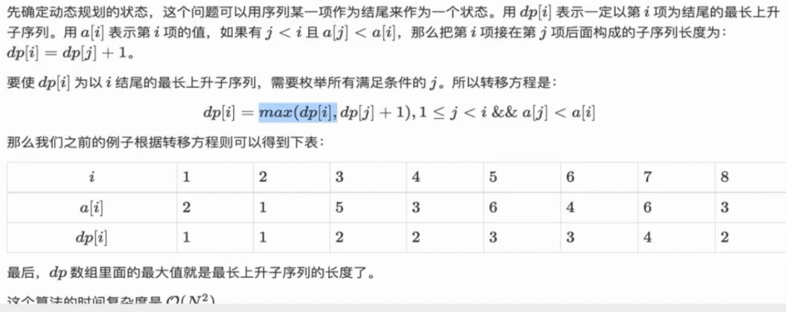

# 题目
- [最长递增子序列](https://leetcode-cn.com/problems/longest-increasing-subsequence/)
- longest increasing subsequence

# 解析
- [leetcode题解](https://leetcode-cn.com/problems/longest-increasing-subsequence/solution/)
## 方法一：使用动态规划求解

- 注意dp[i]表示以数组第i个元素结尾的最长递增子序列的长度
$$
时间复杂度 O(n^2)
$$
## Java实现

```java
class Solution {
    public int lengthOfLIS(int[] nums) {
        int[] dp = new int[nums.length];
        int ans = 0;
        for(int i = 0; i < nums.length; ++i){
            dp[i] = 1;
            for(int j = 0; j <= i; ++j){
                if(nums[j] < nums[i]) dp[i] = Math.max(dp[i], dp[j] + 1);
                ans = Math.max(ans, dp[i]);
            }
        }
        return ans;
    }
}
```

## 方法二：动态规划+二分法 todo