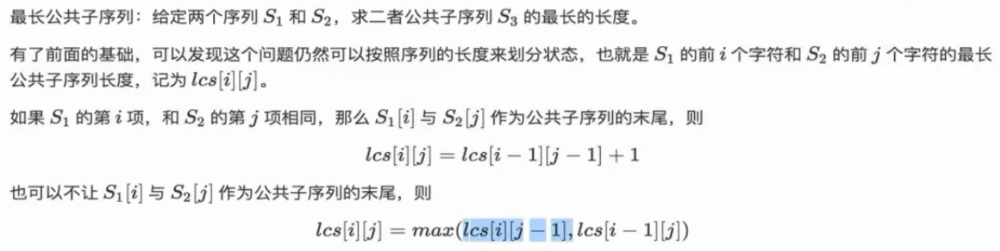
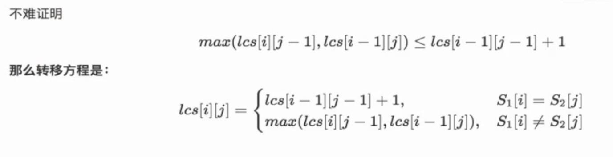
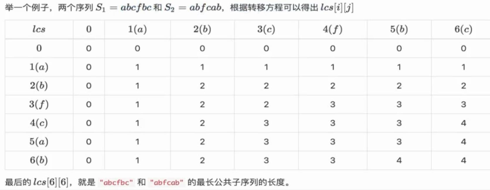

# 题目
- [最长公共子序列](https://leetcode-cn.com/problems/longest-common-subsequence/)
- longest common subsequence
# 解析
- 这是一个二维的动态规划问题




- 关于不相等的转移方程：可以这么理解：既然两个位置不等，那么就求这两个位置之前的一个最大值
- 而显然，越靠近这两个位置的值越大，那么就取各自减1的位置就行了
- 这个不相等时的转移方程是一定要有的，因为不像最大公共子串，它维护了一个最大值，一旦不相等了不需要看前面的累计，不需要任何处理，继续往下走就行
- 而这里是求子序列，序列是可以不连续的，所以必须每个点都要存值
# Java实现

```java
class Solution {
    public int longestCommonSubsequence(String text1, String text2) {
        int len1 = text1.length();
        int len2 = text2.length();
        int[][] dp = new int[len1 + 1][len2 + 1];
        for(int i = 1; i <= len1; ++i){
            for(int j = 1; j <= len2; ++j){
                if(text1.charAt(i - 1) == text2.charAt(j - 1)) dp[i][j] = dp[i - 1][j - 1] + 1;
                else dp[i][j] = Math.max(dp[i - 1][j], dp[i][j - 1]);
            }
        }
        return dp[len1][len2];
    }
}
```

- 如果不使用len + 1长度的数组，就必须这样写：

```java
class Solution {
    public int longestCommonSubsequence(String text1, String text2) {
        int len1 = text1.length();
        int len2 = text2.length();
        int[][] dp = new int[len1][len2];
        for(int i = 0; i < len1; ++i){
            for(int j = 0; j < len2; ++j){
                if(text1.charAt(i) == text2.charAt(j)) {
                    if(i == 0 || j == 0) dp[i][j] = 1;
                    else dp[i][j] = dp[i - 1][j - 1] + 1;
                }
                else {
                    if(i == 0 && j == 0) dp[i][j] = 0;
                    else if(i == 0) dp[i][j] = dp[i][j - 1];
                    else if(j == 0) dp[i][j] = dp[i - 1][j];
                    else dp[i][j] = Math.max(dp[i - 1][j], dp[i][j - 1]);
                }
            }
        }
        return dp[len1 - 1][len2 - 1];
    }
}
```