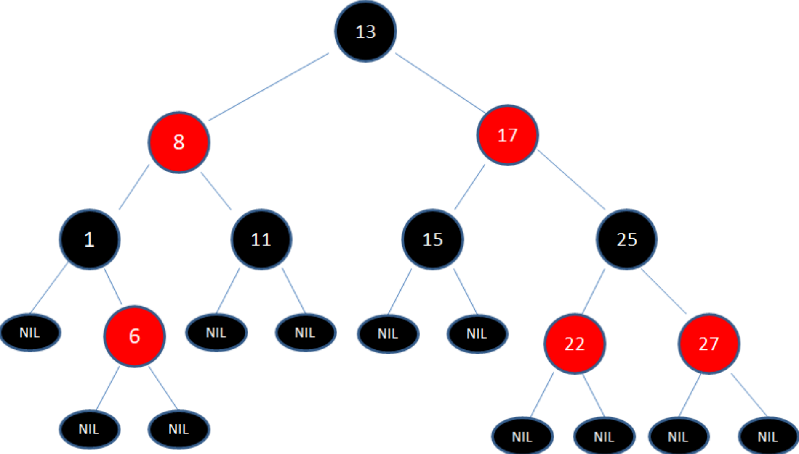
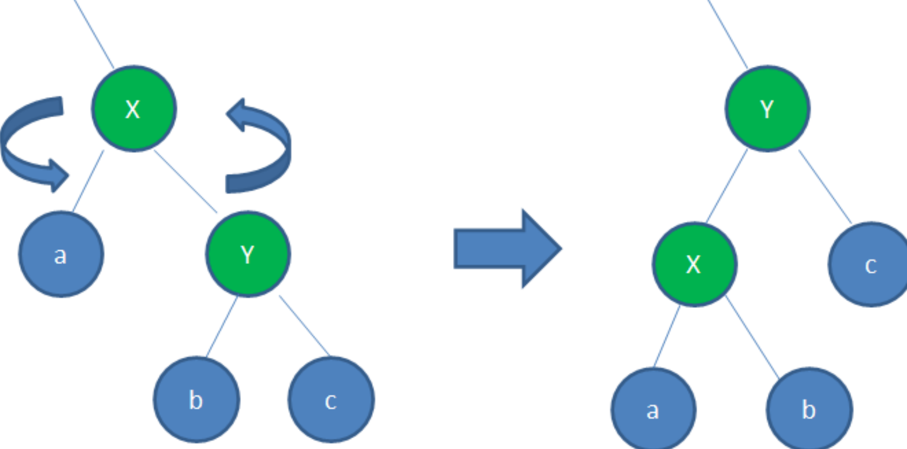
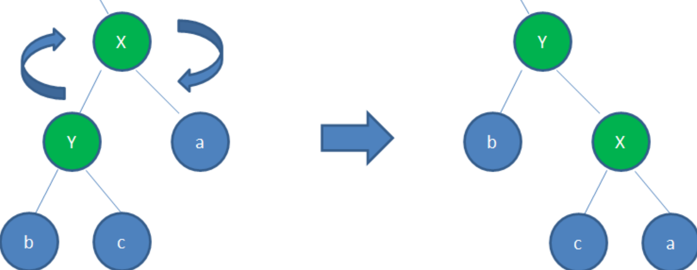

# 红黑树

## 红黑树的特点
红黑树是一种自平衡的BST（二叉查找树），解决了BST的缺陷

---

1. 结点是红色或黑色
2. 根结点是`黑色`
3. 每个叶子结点都是`黑色`的`空`结点（NIL结点） 
4. 每个红色结点的子结点是黑色
5. 从任一结点到其每个叶子的所有路径都包含相同数目的黑色结点
6. 新插入的节点是`红色`
---
- 根到叶子的最长路径不会超过最短路径的2倍

## 红黑树的调整方法
- 变色
- 左旋：逆时针旋转红黑树的两个结点，使得父结点被自己的右孩子取代，而自己成为自己的左孩子
- 右旋：顺时针旋转红黑树的两个结点，使得父结点被自己的左孩子取代，而自己成为自己的右孩子
---
- 左旋：

- 右旋：

## 插入节点
红黑树插入节点分为5种情况：
1. 位于树根：直接变黑色即可
2. 父节点是黑色：无需调整
3. 父结点和叔叔结点都是红色：连续变色调整
4. 有点复杂，理解即可
5. 同上

## 删除节点
- 删除类似于BST的删除，但还需要根据红黑树的特点调整，调整有亿点复杂

# AVL树
## AVL树的特点

AVL是根据发明者的名字命名的

---

- AVL树是严格的平衡二叉树，每个节点的左右子树高度差不超过1

## 平衡因子
- 对于AVL树的每一个结点，平衡因子是它的左子树高度和右子树高度的差值
- 只有当二叉树所有结点的平衡因子都是-1, 0, 1这三个值的时候，这颗二叉树才是一颗合格的AVL树

## AVL树的调整方法
- 和红黑树差不多，但没有变色，只有旋转，相比红黑树更易理解

# 红黑树和AVL树的区别
- 由于AVL的特点，AVL查找效率更高，但`调整的成本也高`
- 在需要频繁查找时，使用AVL；频繁插入删除时，使用红黑树，如HashMap底层就是

# 参考
- [漫画：什么是红黑树？（整合版）](https://mp.weixin.qq.com/s?__biz=MzIwMTAzMTMxMg==&mid=2649496932&idx=1&sn=8c020f69378c2d0959a9842b5f948ea0&chksm=8eec969bb99b1f8de57ed872f9bce1a309dca127c814325cc8bd13a2b2b2d23b2999ff5f36b9&mpshare=1&scene=24&srcid=&sharer_sharetime=1593614315636&sharer_shareid=f6cbb58db594bbc05836e46394e8fd80&key=ea68e03694d3461837809b887bb903fe95c8d1209bce63f4ad3b1778b49b2226fc1f811d35ae1827e0816bb1747b78499c772017f3967767c968738374b683a10736a7a35ed65bae6b17b3732e789bc1&ascene=1&uin=MzQ3MjE1OTMwNA%3D%3D&devicetype=Windows-QQBrowser&version=6103000b&lang=zh_CN&exportkey=AwI8fNBQ04BYkOUmBwhKO9c%3D&pass_ticket=HWeOQWbIY55EgidilfbR3Nk0TIlv%2BAGiHCKKoW5%2BCHB1UR92u1A3i8fTHPU0IrZS&wx_header=0)
- [漫画：什么是AVL树？（修订版）](https://mp.weixin.qq.com/s?__biz=MzIxMjE5MTE1Nw==&mid=2653206226&idx=2&sn=9026eddb485cecc91171e75c118d1231&chksm=8c99c408bbee4d1e4755bfd22e8202e3b6458125d862c4d0cda4f6dcecf5eff5be5dedafe04b&mpshare=1&scene=24&srcid=&sharer_sharetime=1592316716207&sharer_shareid=f6cbb58db594bbc05836e46394e8fd80&key=aa74e2d5d4efa9be0b601d67f1c2ccdaa0e2151772130087a40b0debfb1eef6e7f68d28274ddaf725ae2dd4a3aa423e6db319d0f2ac2ad83e5eebd03dac9019c3bf890eaefe660c410a0546ecf7e96bb&ascene=1&uin=MzQ3MjE1OTMwNA%3D%3D&devicetype=Windows-QQBrowser&version=6103000b&lang=zh_CN&exportkey=A63%2BPcy%2BuhVW30IBv0BUzbk%3D&pass_ticket=%2B6XeIp5lfunG46cQEvz%2BRm64wxKI2neXN6672z%2B7q8PoCcnPbkZEWNGPne5DxNG5)