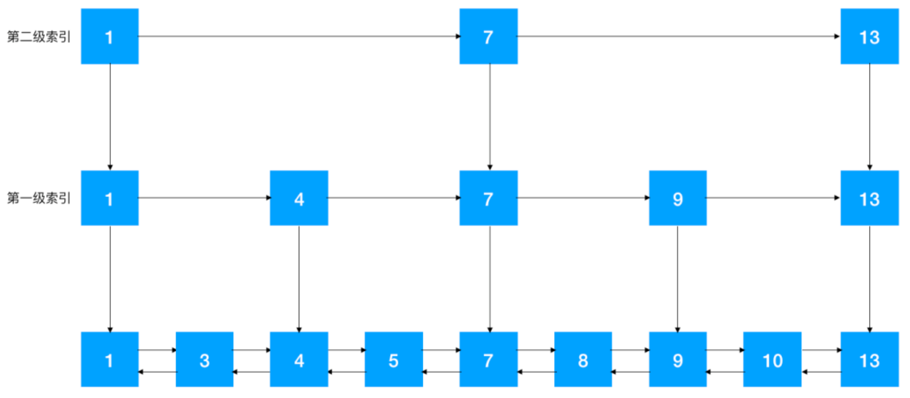
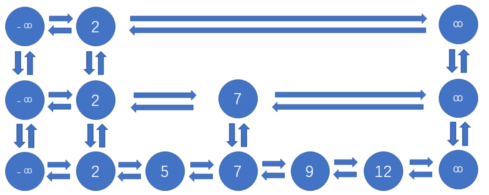

## 跳表是什么

- 跳表是在链表之上加上多层索引构成的
- 程序中跳表采用的是双向链表，无论前后结点还是上下结点，都各有两个指针相互指向彼此
- 每一层首位各有一个空结点，左侧的空节点是负无穷大，右侧的空节点是正无穷大
- 之所以这样设计，是为了方便代码实现
- 跳表可以说是链式的二分查找，平均时间复杂度是O（logn）
- 空间复杂度：各层索引的结点总数是n/2+n/4+n/8+n/16+...，约等于n，所以占用空间为普通链表的2倍
- 跳表的结构已经和 B+ 树非常接近了，只不过 B+ 树是从平衡二叉查找树演化而来的而已




## 新增节点

- 先在原始list上新增，然后调整索引，让新插入的结点随机“晋升”，也就是成为索引结点。新结点晋升成功的几率是50%。
- 新结点在成功晋升之后，仍然有机会继续向上一层索引晋升
- 如果连续晋升成功，超过最高层索引，就增加一层索引

## 删除节点

- 先在原始list上删除，如果该节点有对应的索引节点，则把索引节点也删除
- 类似的，如果某层索引节点全部被删除，则要删除该层索引

## Java实现

```java
import java.util.Random;

/**
 * 该实现不支持重复元素
 */
public class SkipList {

    private static final double PROMOTE_RATE = 0.5;//结点晋升的概率
    private Node head, tail;//head是最上层的头节点，tail是最上层的尾节点
    private int maxLevel = 0;
    private static final int MAX = Integer.MAX_VALUE;
    private static final int MIN = Integer.MIN_VALUE;

    public SkipList() {
        head = new Node(MIN);
        tail = new Node(MAX);
        head.right = tail;
        tail.left = head;
    }

    //链表结点类
    public class Node {
        public int data;
        public Node up, down, left, right;//跳表结点的前后和上下都有指针
        public Node(int data) {
            this.data = data;
        }
    }

    //查找结点
    public Node search(int data) {
        Node p = findNode(data);
        if (p.data == data) {
            System.out.println("找到结点：" + data);
            return p;
        }
        System.out.println("未找到结点：" + data);
        return null;
    }

    //找到值对应的前置结点
    //如果存在相同的值，则会返回对应的节点（用于查询结点）
    private Node findNode(int data) {
        Node node = head;
        while (true) {
            while (node.right.data != MAX && node.right.data <= data)
                node = node.right;
            if (node.down == null) break;
            node = node.down;
        }
        return node;
    }

    //插入结点
    public void insert(int data) {
        Node preNode = findNode(data);
        //如果data相同，直接返回
        if (preNode.data == data) return;
        Node node = new Node(data);
        appendNode(preNode, node);
        int currentLevel = 0;
        //随机决定结点是否晋升
        Random random = new Random();
        while (random.nextDouble() > PROMOTE_RATE) {
            //如果当前层已经是最高层，需要增加一层
            if (currentLevel == maxLevel) addLevel();
            //找到上一层的前置节点
            while (preNode.up == null) preNode = preNode.left;
            preNode = preNode.up;
            //把晋升的新结点插入到上一层
            Node upperNode = new Node(data);
            appendNode(preNode, upperNode);
            upperNode.down = node;
            node.up = upperNode;
            node = upperNode;
            currentLevel++;
        }
    }

    //在前置结点后面添加新结点
    private void appendNode(Node preNode, Node newNode) {
        newNode.left = preNode;
        newNode.right = preNode.right;
        preNode.right.left = newNode;
        preNode.right = newNode;
    }

    //增加一层
    private void addLevel() {
        maxLevel++;
        Node p1 = new Node(MIN);
        Node p2 = new Node(MAX);
        p1.right = p2;
        p2.left = p1;
        p1.down = head;
        head.up = p1;
        p2.down = tail;
        tail.up = p2;
        head = p1;
        tail = p2;
    }

    //删除结点
    public boolean remove(int data) {
        Node removedNode = search(data);
        if (removedNode == null) return false;
        int currentLevel = 0;
        while (removedNode != null) {
            removedNode.right.left = removedNode.left;
            removedNode.left.right = removedNode.right;
            //如果不是最底层，且只有无穷小和无穷大结点，删除该层
            if (currentLevel != 0 && removedNode.left.data == MIN && removedNode.right.data == MAX)
                removeLevel(removedNode.left);
            currentLevel++;
            removedNode = removedNode.up;
        }
        return true;
    }

    //删除一层
    private void removeLevel(Node leftNode) {
        Node rightNode = leftNode.right;
        //如果删除层是最高层 todo 删除的层一定是最高层吧？
        if (leftNode.up == null) {
            leftNode.down.up = null;
            rightNode.down.up = null;
        } else {
            leftNode.up.down = leftNode.down;
            leftNode.down.up = leftNode.up;
            rightNode.up.down = rightNode.down;
            rightNode.down.up = rightNode.up;
        }
        maxLevel--;
    }

    //输出底层链表
    public void printList() {
        Node node = head;
        while (node.down != null) node = node.down;
        while (node.right.data != MAX) {
            System.out.print(node.right.data + " ");
            node = node.right;
        }
        System.out.println();
    }

    public static void main(String[] args) {
        SkipList list = new SkipList();
        list.insert(50);
        list.insert(15);
        list.insert(13);
        list.insert(99);
        list.insert(20);
        list.insert(100);
        list.insert(75);
        list.insert(99);
        list.insert(76);
        list.insert(83);
        list.insert(65);
        list.printList();
        list.search(50);
        System.out.println("删除结点50：" + list.remove(50));
        list.search(50);
    }
}
```


## 参考

- [漫画：什么是 “跳表” ？](https://mp.weixin.qq.com/s/Ok0laJMn4_OzL-LxPTHawQ)
- [面试官，你要是敢在问我B+树，别怪我不客气！！](https://mp.weixin.qq.com/s?__biz=Mzg2NzA4MTkxNQ==&mid=2247487296&idx=1&sn=98f6fd5042117e73e4cfe57741a28372&chksm=ce404494f937cd820e254a7248d8777891c7de35e9472fb4b9f27730523a6bfb5fecd7261b62&mpshare=1&scene=1&srcid=&sharer_sharetime=1586774132725&sharer_shareid=f6cbb58db594bbc05836e46394e8fd80#rd)

