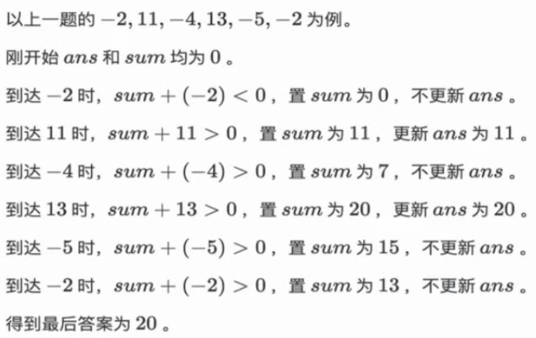

# 题目
- [连续子数组的最大和](https://leetcode-cn.com/problems/lian-xu-zi-shu-zu-de-zui-da-he-lcof/)，或者叫`最大子段和`

# 解析
- 用dp
- 对于全是非正数的序列，答案明显就是其中的元素的最大值
- 对于有正数的序列，考虑以每一个点为结尾的最大子段和，这个子段一定满足其前缀和均非负，因为如果有一个前缀是负的，那么减掉这个前缀对于这个点一定更优，并且这个子段要尽量往前延伸
- 所以我们可以只用一次扫描，记录目前统计的和sum以及答案ans。当sum加上当前位置这个数还是正数的时候就继续累加sum，否则就将sum置为0。这样就舍掉了所有前缀是负数的情况，并且保证了这个子段尽可能的长了，也就是说扫描中记录的sum就是以每一个点为结尾的最大子段和，每一次如果sum比ans大就可以更新ans。
- 最后ans就是整体的最大子段和。
- 时间复杂度O(N)。




# Java实现
```java
class Solution {
    public int maxSubArray(int[] nums) {
        int sum = 0, ans = 0, max = nums[0];
        for(int i = 1; i < nums.length; ++i)
            if(nums[i] > max) max = nums[i];
        if(max <= 0) return max;
        else{
            for(int i = 0; i < nums.length; ++i){
                sum += nums[i];
                if(sum < 0) sum = 0;
                if(sum > ans) ans = sum;
            }
            return ans;
        }
    }
}
```
- 简洁版
```java
class Solution {
    public int maxSubArray(int[] nums) {
        int res = nums[0];
        for(int i = 1; i < nums.length; i++) {
            nums[i] += Math.max(nums[i - 1], 0);
            res = Math.max(res, nums[i]);
        }
        return res;
    }
}
```
- 暴力法（超时）
```java
class Solution {
    public int maxSubArray(int[] nums) {
        int sum = 0, ans = -2147483648, len = nums.length;
        for(int i = 0; i < len; ++i){
            for(int j = 0; j < len - i; ++j){
                for(int k = i; k <= i + j; ++k){
                    sum += nums[k];
                }
                if(sum > ans) ans = sum;
                sum = 0;
            }
        }
        return ans;
    }
}
```